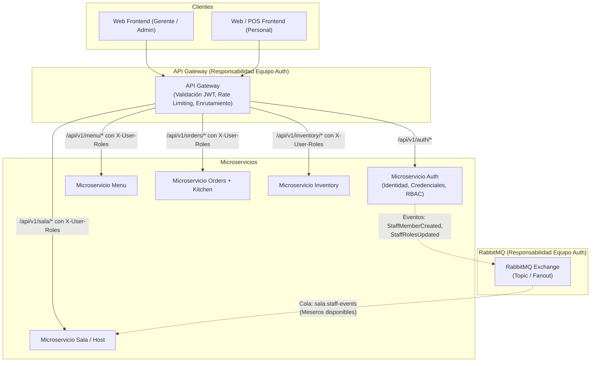

# Plan de Especificación Formal ERS — Microservicio de Auth

Este documento establece la estrategia y propuesta técnica para la definición y formalización del microservicio **Auth** (Autenticación, Autorización y Gestión de Personal) del ecosistema **FMAT-Restaurant**, siguiendo las normas metodológicas de la asignatura *Verificación y Validación* de la Facultad de Matemáticas (UADY).

Adicionalmente, se contemplan las responsabilidades cruzadas asignadas al equipo: el **API Gateway** (validación perimetral de credenciales y propagación de claims) y la **Cola de Eventos / RabbitMQ** (emisión de eventos de dominio como `StaffMemberCreated` y `StaffRolesUpdated` para alimentar a microservicios como Sala/Host y Órdenes).

---

## Decisiones de Diseño Propuestas

### 1. Modelo de Identidad y Cuentas
- **Gerente / Administrador (`RestaurantOwner` / `Admin`)**:
  - Se registra mediante Email + Contraseña + Datos de Restaurante (`restaurantName`, `address`, etc.).
  - Genera automáticamente un Tenant (`Restaurant`) y un usuario raíz con rol `ADMINISTRADOR`.
  - El rol `ADMINISTRADOR` es exclusivo y no transferible a miembros del personal ordinario a través del flujo de personal.
- **Personal (`StaffMember`)**:
  - Creado exclusivamente por el Gerente/Administrador de su restaurante.
  - Se le asigna un identificador único con máscara `XYYYYYY`.
  - Se genera una contraseña temporal con estado `passwordStatus = TEMPORARY` (o `mustChangePassword = true`).
  - Al iniciar sesión con credenciales temporales, el sistema devuelve un token con alcance restringido o marca de cambio forzoso, requiriendo llamar a `POST /auth/change-initial-password` antes de poder consumir endpoints operacionales.
  - Al cambiar la contraseña, el identificador `XYYYYYY` se preserva intacto y `passwordStatus` pasa a `ACTIVE`.

### 2. Estructura del Identificador de Personal (`XYYYYYY`)
Se propone formalizar el formato canónico `^[A-Z][0-9]{6}$` (1 letra mayúscula seguida de 6 dígitos numéricos secuenciales o pseudoaleatorios únicos por restaurante o globales):
- **Propuesta A (Prefijo por Rol Inicial de Contratación):** `X` representa el rol con el que ingresa (`H` = Host, `A` = Almacenista, `M` = Mesero, `C` = Chef Master), pero si se le asignan roles secundarios, el identificador permanece inmutable.
- **Propuesta B (Prefijo Genérico de Empleado):** `X = 'E'` para todos los empleados de planta (ej. `E000001`, `E000002`), garantizando neutralidad ante cambios de rol múltiples.
- **Propuesta C (Prefijo por Restaurante / Sucursal):** `X` asignado por sucursal/restaurante.
*(Ver sección de Preguntas Abiertas)*.

### 3. Matriz de Roles y Vistas (RBAC)
Cada empleado tiene asignado al menos 1 rol, con soporte a múltiples roles:

| Rol | Alcance / Vistas en Dashboard | Microservicios Asociados |
| :--- | :--- | :--- |
| **Administrador** | Acceso global a configuración, personal, métricas y todos los módulos. | Auth, Menu, Orders, Inventory, Sala, Billing |
| **Host** | Asignación de comensales a mesas, visualización de estado de mesas y meseros activos. | Sala, Auth (vía eventos/proyección de meseros) |
| **Almacenista** | Control de existencias físicas, entradas/salidas, mermas e inventario. | Inventory |
| **Mesero** | Apertura de comandas, toma de pedidos por mesa, consulta de catálogo y solicitud de cuenta. | Orders + Kitchen, Menu, Sala, Billing |
| **Chef Master** | Visualización y despacho de comandas en KDS (cocina), actualización de preparación y recetas. | Orders + Kitchen, Inventory |

---

## User Review Required

> [!IMPORTANT]
> **Integración entre Auth, Sala y Host:**
> El usuario especificó: *"Host (Asigna comensales a sus mesas, consume la lista de meseros)"*. Esto confirma que el microservicio **Sala/Host** requiere conocer la lista de usuarios con rol `MESERO` activos en el restaurante. Propondremos que Auth emita eventos a través de RabbitMQ (`StaffMemberCreated`, `StaffRolesUpdated`, `StaffStatusChanged`) para que Sala mantenga una proyección desacoplada de meseros sin acoplamiento sincrónico.

> [!WARNING]
> **Mecanismo de Forzado de Cambio de Contraseña:**
> Cuando un miembro con contraseña temporal ingresa al dashboard, el API Gateway / Backend debe denegar el acceso a los microservicios operativos hasta que complete el cambio de contraseña. Se propone emitir un JWT inicial con claim `mustChangePassword: true` o un token temporal de un solo uso para cambio de contraseña.

---

## Open Questions

> [!NOTE]
> Por favor valida las siguientes opciones para incorporarlas a la versión definitiva del ERS:

1. **Definición de la letra `X` en el ID `XYYYYYY`:**
   - ¿Prefieres la **Propuesta B** (Prefijo genérico como `E000123` para todo el personal) para que no haya inconsistencias cuando un miembro tenga múltiples roles (ej. Mesero y Host)?
   - ¿O prefieres la **Propuesta A** donde `X` es la inicial del rol con el que fue creado inicialmente (`M` = Mesero, `H` = Host, `A` = Almacenista, `C` = Chef Master)?
2. **Autenticación del Administrador (Gerente):**
   - El Administrador, ¿inicia sesión con **Correo Electrónico** (`gerente@restaurante.com`) o también se le asigna un ID tipo `XYYYYYY` (por ejemplo `A000001` o `G000001`)?
   - *(Recomendación técnica)*: Que el Administrador use Email + Contraseña, mientras que el personal operativo use su `Staff ID` (`XYYYYYY`) + Contraseña/PIN, optimizando el uso en terminales táctiles (POS/KDS).
3. **Persistencia y Base de Datos del Microservicio Auth:**
   - ¿Tienen ya una preferencia tecnológica consensuada con el salón (ej. PostgreSQL, MySQL, MongoDB)? Sugerimos PostgreSQL con Prisma/TypeORM o Hibernate/SQLModel según el stack elegido.

---

## Proposed Changes

Crearemos la documentación en el repositorio [Auth-Documentation](file:///Users/rubenperez/Documents/UADY/Verificacion%20y%20Validacion/Auth-Documentation) respetando la convención de ingeniería de requisitos y V&V vista en `Menu-Documentation`:

### Módulo Documental: `Auth-Documentation`

#### [NEW] [README.md](file:///Users/rubenperez/Documents/UADY/Verificacion%20y%20Validacion/Auth-Documentation/README.md)
Presentación formal del microservicio Auth, responsabilidades del equipo (Auth, API Gateway, RabbitMQ), arquitectura general y tabla de contenidos.

#### [NEW] [context.md](file:///Users/rubenperez/Documents/UADY/Verificacion%20y%20Validacion/Auth-Documentation/output/ers/context.md)
Contexto del Bounded Context Auth, definición de actores (Administrador, Host, Almacenista, Mesero, Chef Master), límites de ownership de datos (Auth es autoridad exclusiva sobre identidades, credenciales, tokens y asignación de roles).

#### [NEW] [architecture.md](file:///Users/rubenperez/Documents/UADY/Verificacion%20y%20Validacion/Auth-Documentation/output/ers/architecture.md)
Arquitectura interna del microservicio, diagrama C4 / Flujos de interacción, diseño del modelo Entidad-Relación (Usuario, Personal, Rol, Sesión/RefreshToken), especificación del token JWT (Claims estándar y personalizados: `sub`, `staffId`, `roles`, `mustChangePassword`), relación con API Gateway y contratos de eventos en RabbitMQ.

#### [NEW] [business-rules.md](file:///Users/rubenperez/Documents/UADY/Verificacion%20y%20Validacion/Auth-Documentation/output/ers/business-rules.md)
Reglas de negocio formales (`BR-AUTH-001` a `BR-AUTH-020`) e invariantes matemáticas de integridad (`INV-AUTH-001` a `INV-AUTH-010`), tales como:
- Unicidad e inmutabilidad del `staffId`.
- Obligatoriedad de asignación de al menos un rol al personal.
- Exclusividad del rol `ADMINISTRADOR`.
- Restricción estricta de operaciones operacionales bajo contraseña temporal.
- Esquema single-tenant con base de datos local dedicada.

#### [NEW] [functional-requirements.md](file:///Users/rubenperez/Documents/UADY/Verificacion%20y%20Validacion/Auth-Documentation/output/ers/functional-requirements.md)
Catálogo formal de requisitos funcionales (`REQ-AUTH-001` a `REQ-AUTH-025`) bajo el esquema estricto de V&V:
- `Identificador`: `REQ-AUTH-XXX`
- `Título`
- `Requisito` (modal "El servicio Auth deberá...")
- `Tipo`: Funcional
- `Fuente`: Especificación FMAT Softrestaurant / Roles de Dominio
- `Verificación`: Método (Inspección, Demostración, Prueba, Análisis) y Criterio de Verificación detallado.
- `Estado`: Confirmado / Propuesto
- `Reglas e Invariantes Relacionadas`

#### [NEW] [non-functional-requirements.md](file:///Users/rubenperez/Documents/UADY/Verificacion%20y%20Validacion/Auth-Documentation/output/ers/non-functional-requirements.md)
Requisitos de Seguridad (algoritmo de hash Argon2id/bcrypt, salazón, entropía, expiración de tokens, protección de secretos), Rendimiento (latencia < 50ms para introspección/validación de token en Gateway), Disponibilidad y Auditoría.

#### [NEW] [configuration.md](file:///Users/rubenperez/Documents/UADY/Verificacion%20y%20Validacion/Auth-Documentation/output/ers/configuration.md)
Variables de entorno, perfiles de ejecución, configuración de RabbitMQ (exchanges, queues, routing keys de staff) y claves asimétricas para firma de tokens (RSA/Ed25519 o HMAC).

#### [NEW] [traceability.md](file:///Users/rubenperez/Documents/UADY/Verificacion%20y%20Validacion/Auth-Documentation/output/ers/traceability.md)
Matriz de trazabilidad entre Requisitos Funcionales, Reglas de Negocio, Endpoints REST, Eventos RabbitMQ y Criterios de Verificación.

---

## Verification Plan

### Automated & Consistency Checks
- Validación de sintaxis markdown y compatibilidad con renderizadores de MkDocs y GitHub Flavored Markdown.
- Verificación de consistencia cruzada en identificadores (`REQ-AUTH-XXX`, `BR-AUTH-XXX`, `INV-AUTH-XXX`).
- Verificación de diagramas Mermaid (sintaxis y flujo lógico).

### Manual Verification
- Revisión conjunta con el usuario de las reglas de negocio, roles y decisiones abiertas antes de pasar a la fase de implementación de código en `Auth-Backend` y `Auth-Frontend`.
