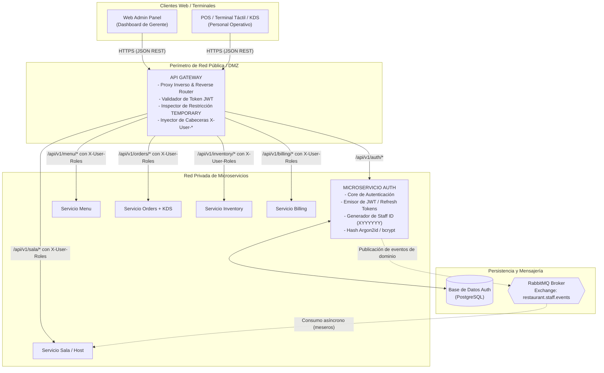
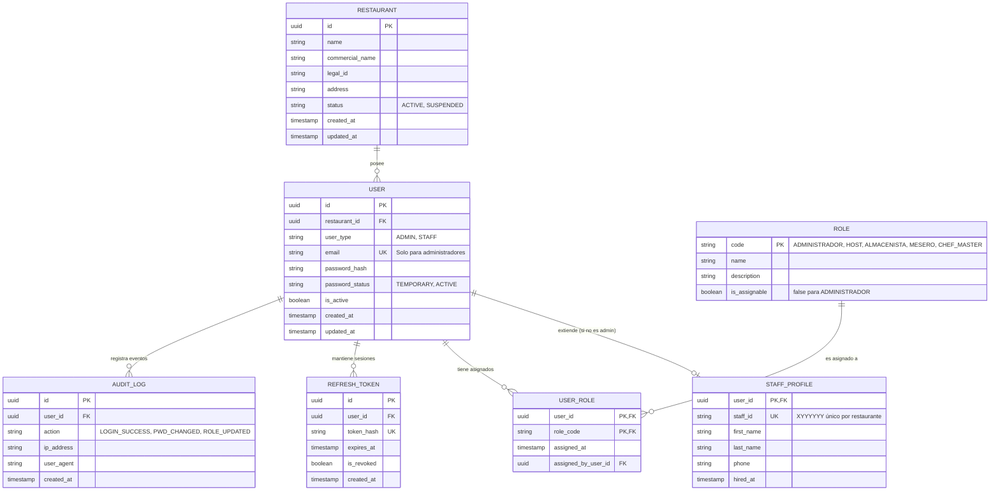
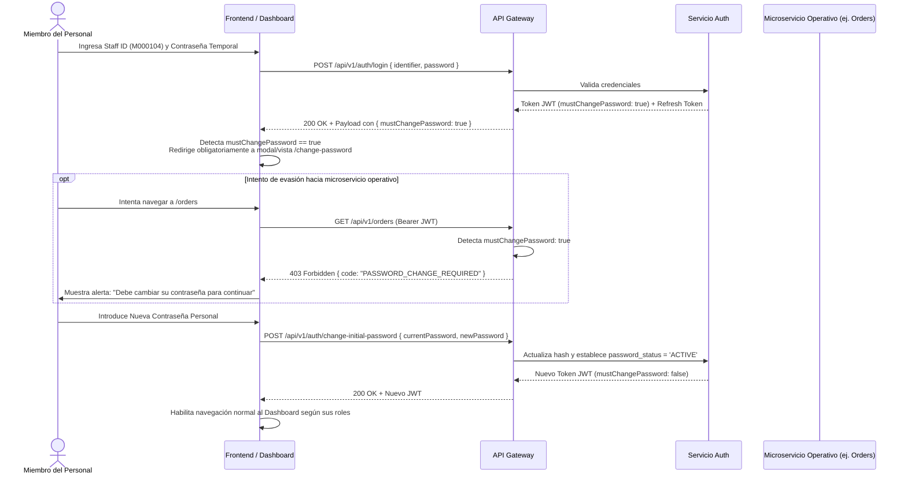

# Arquitectura del Sistema, Componentes y Flujos Técnicos

## Diagrama de Contenedores y Flujo Perimetral

La solución articula tres elementos técnicos bajo la responsabilidad directa del equipo de **Auth**: el servicio de **Autenticación (Auth MS)**, el **API Gateway** y el broker de mensajería **RabbitMQ**.



---

## El Rol del API Gateway en la Autorización

El **API Gateway** actúa como el guardián perimetral del sistema. Ningún microservicio interno (Menu, Orders, Sala, Inventory, etc.) expone sus puertos directamente al internet público. 

### Responsabilidades Perimetrales del Gateway:
1. **Validación Criptográfica de JWT:** Verifica la firma digital del token (`RS256` o `HS256`), la expiración temporal (`exp`) y el emisor (`iss`).
2. **Evaluación de Contraseña Temporal (`passwordStatus == TEMPORARY`):**
   - Si un usuario presenta un token con `mustChangePassword: true`, el API Gateway **rechaza** cualquier petición dirigida a microservicios operativos (`/api/v1/orders/*`, `/api/v1/menu/*`, etc.) con un código HTTP `403 Forbidden` y el error estructurado `PASSWORD_CHANGE_REQUIRED`.
   - Únicamente permite peticiones dirigidas a:
     - `POST /api/v1/auth/change-initial-password`
     - `POST /api/v1/auth/logout`
     - `GET /api/v1/auth/me`
3. **Propagación Segura de Identidad (Header Sanitization):**
   El API Gateway elimina cualquier cabecera `X-User-*` proveniente del cliente exterior para prevenir inyección de identidad (*Header Spoofing*), y tras validar el JWT, inyecta cabeceras confiables hacia la red interna:
   - `X-User-Id`: UUID único del usuario.
   - `X-Staff-Id`: Identificador `XYYYYYY` (o `ADMIN` para administradores).
   - `X-Restaurant-Id`: UUID del restaurante propietario.
   - `X-User-Roles`: Lista separada por comas (`HOST,MESERO`).

---

## Especificación del Token de Acceso (JWT)

El token de acceso emitido por el servicio Auth es un JSON Web Token estándar (RFC 7519).

### Formato de Cabecera (Header)
```json
{
  "alg": "RS256",
  "typ": "JWT",
  "kid": "auth-key-2026-v1"
}
```

### Formato de Carga Útil (Payload / Claims)
```json
{
  "iss": "urn:fmat:restaurant:auth",
  "sub": "usr_9b1deb4d-3b7d-4bad-9bdd-2b0d7b3dcb6d",
  "aud": "urn:fmat:restaurant:api",
  "iat": 1790294400,
  "exp": 1790298000,
  "restaurantId": "rest_a1b2c3d4-e5f6-7890-abcd-ef1234567890",
  "staffId": "M000104",
  "username": "M000104",
  "displayName": "Carlos Pérez",
  "roles": [
    "MESERO"
  ],
  "mustChangePassword": true
}
```

### Definición de Claims:
- `sub`: Identificador universal único del usuario (UUID v4).
- `restaurantId`: Identificador del restaurante para aislamiento multi-tenant.
- `staffId`: Identificador asignado (`XYYYYYY`). Para el Administrador/Gerente toma el valor literal `ADMIN`.
- `roles`: Array de cadenas con los roles autorizados: `ADMINISTRADOR`, `HOST`, `ALMACENISTA`, `MESERO`, `CHEF_MASTER`.
- `mustChangePassword`: Booleano que indica si el usuario debe actualizar obligatoriamente su clave temporal antes de operar.

---

## Modelo Entidad-Relación y Persistencia

El modelo de datos relacional de Auth garantiza la integridad referencial, el aislamiento por restaurante y el soporte estricto a roles múltiples.



---

## Flujo de Primer Ingreso y Forzado de Contraseña

Este diagrama de secuencia ilustra el flujo de control cuando un miembro del personal ingresa con su clave temporal:



---

## Integración con RabbitMQ (Eventos de Personal)

El servicio Auth actúa como productor de eventos para notificar al clúster de cambios relevantes en el personal.

### Topología de Mensajería:
- **Exchange:** `restaurant.staff.events` (Tipo `topic`, durable).
- **Routing Keys:**
  - `staff.created`: Emitido cuando el gerente da de alta un nuevo empleado.
  - `staff.roles.updated`: Emitido al modificar los roles de un empleado.
  - `staff.status.changed`: Emitido al activar o desactivar un perfil de personal.

### Ejemplo de Evento: `StaffMemberCreated`
```json
{
  "specversion": "1.0",
  "type": "urn:fmat:event:staff:member-created",
  "source": "urn:fmat:service:auth",
  "id": "evt_7f1c4e92-31d8-4fbb-b2d9-11c2a048a120",
  "time": "2026-09-24T18:30:00Z",
  "datacontenttype": "application/json",
  "data": {
    "restaurantId": "rest_a1b2c3d4-e5f6-7890-abcd-ef1234567890",
    "userId": "usr_9b1deb4d-3b7d-4bad-9bdd-2b0d7b3dcb6d",
    "staffId": "M000104",
    "firstName": "Carlos",
    "lastName": "Pérez",
    "roles": ["MESERO"],
    "isActive": true
  }
}
```

### Consumo en Microservicio `Sala`:
- El servicio Sala mantiene una cola enlazada a `staff.*` para actualizar su tabla local de meseros elegibles, garantizando que el `Host` disponga siempre de la lista vigente de meseros en piso para asignación de mesas.
