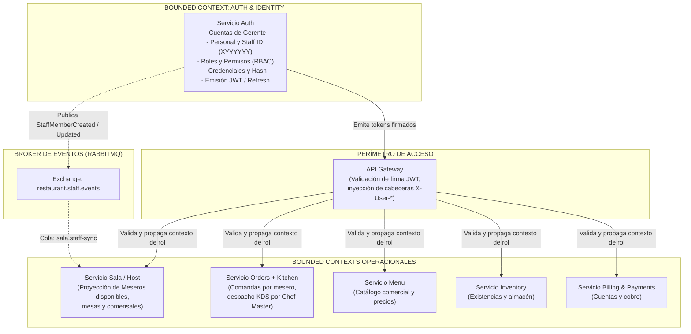
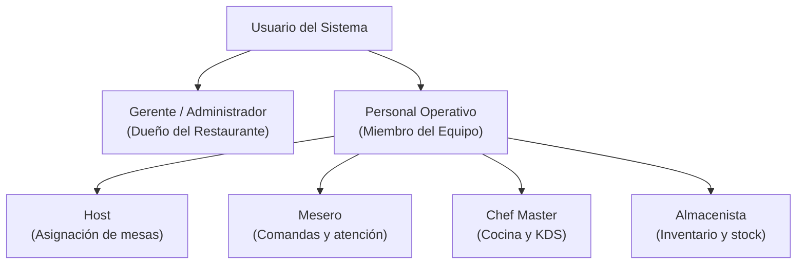

# Contexto, Alcance y Lenguaje del Dominio (Auth)

## Responsabilidades del Bounded Context Auth

El servicio **Auth** es la autoridad exclusiva sobre la **identidad, autenticación, autorización y administración de personal** del ecosistema distribuido FMAT Restaurant. Sus responsabilidades se concentran en dar respuesta certera y verificable a cuatro preguntas fundamentales del sistema:

1. **¿Quién es el actor que intenta acceder al sistema?** (Autenticación e identificación unívoca).
2. **¿A qué restaurante o tenant pertenece su cuenta?** (Aislamiento de dominio multi-restaurante).
3. **¿Qué funciones, vistas y microservicios está autorizado a operar?** (Control de acceso basado en roles - RBAC).
4. **¿Cuál es el estado operativo de sus credenciales de acceso?** (Vigencia de contraseña, forzado de actualización de contraseña temporal, sesiones activas).

En consecuencia, las responsabilidades de Auth abarcan:

- **Custodia de credenciales y seguridad:** Almacenamiento seguro, salado y dispersión (hashing) de contraseñas de gerentes y personal operativo mediante funciones de derivación criptográfica de alta resistencia (Argon2id o bcrypt).
- **Aislamiento Multi-Tenant:** Custodiar la pertenencia estricta de cuentas y personal a su respectivo `Restaurant`, asegurando que ningún usuario pueda visualizar ni interactuar con datos ajenos a su tenant.
- **Gestión del ciclo de vida del personal:** Registro, habilitación, deshabilitación y actualización de perfiles de miembros de equipo por parte del Gerente/Administrador del restaurante.
- **Emisión de identificadores estructurados:** Asignación automática e inmutable del identificador de personal con máscara `XYYYYYY` (1 carácter alfabético en mayúscula seguido de 6 dígitos numéricos).
- **Gestión de contraseñas temporales y forzado de primer ingreso:** Proveer contraseñas de primer uso configurables por el administrador y forzar la transición a contraseña personal en el primer inicio de sesión mediante contención operativa perimetral.
- **Autorización basada en roles (RBAC):** Definición y asignación de roles operativos (`HOST`, `ALMACENISTA`, `MESERO`, `CHEF_MASTER`) a cuentas de personal, admitiendo membresía simple o múltiple.
- **Emisión e invalidación de tokens de acceso:** Generación de JSON Web Tokens (JWT) firmados digitalmente que portan la identidad, el tenant, los roles vigentes y el estado de cambio de contraseña, permitiendo la validación descentralizada en el API Gateway y otros servicios.
- **Publicación de eventos operacionales de personal:** Difusión asíncrona mediante RabbitMQ de eventos de dominio (`StaffMemberCreated`, `StaffRolesUpdated`, `StaffStatusChanged`) para la alimentación de proyecciones dependientes en microservicios consumidores (como el listado de meseros elegibles para asignación de mesas en `Sala/Host`).

---

## Límites de Contexto y Ownership de Datos

La arquitectura global del sistema sitúa a Auth como el proveedor de confianza para la identidad de todos los clientes y microservicios:

### Principios Fundamentales de Aislamiento y Ownership

1. **Auth es la autoridad exclusiva sobre identidades y roles:** Ningún otro microservicio (Menu, Orders, Inventory, Sala, Billing) almacena contraseñas, valida credenciales de login ni altera la asignación de roles de un empleado.
2. **Desacoplamiento de nombres y datos operativos:** Microservicios como `Orders` o `Sala` registran el `staffId` (`XYYYYYY`) como una referencia opaca en sus registros (ejemplo: `waiterId: "M000102"` en una orden, o `hostId: "H000045"` al asignar una mesa).
3. **Proyección de Meseros en Sala:** El microservicio `Sala` requiere conocer la lista de meseros activos para que el `Host` pueda asignar comensales a sus mesas correspondientes. Esta necesidad se satisface mediante **proyecciones eventuales** alimentadas por eventos emitidos por Auth (`StaffMemberCreated`, `StaffRolesUpdated`), sin llamadas HTTP síncronas bloqueantes entre Sala y Auth.
4. **Verificación Perimetral en API Gateway:** Los microservicios internos no repiten la autenticación criptográfica pesada en cada endpoint; el API Gateway verifica el token JWT emitido por Auth y despacha a la red interna cabeceras de contexto sanitizadas:
   - `X-User-Id`: Identificador único de usuario.
   - `X-Staff-Id`: Identificador estructurado `XYYYYYY` (o `ADMIN` para gerentes).
   - `X-Restaurant-Id`: Identificador del restaurante (tenant).
   - `X-User-Roles`: Lista serializada de roles activos (`MESERO`, `HOST`, etc.).
   - `X-Password-Temporary`: Indicador booleano de contraseña provisional.

---

## Taxonomía de Actores del Sistema

### 1. Gerente / Administrador (`ADMINISTRADOR`)
- **Naturaleza:** Cuenta raíz del restaurante creada mediante proceso de auto-registro (Sign-up) con correo electrónico comercial.
- **Exclusividad:** El rol `ADMINISTRADOR` es inherente al propietario de la cuenta del restaurante. No se asigna mediante el panel de creación de personal a empleados operativos ordinarios.
- **Capacidades:**
  - Acceso total e irrestricto a todas las vistas, métricas y microservicios del sistema.
  - Creación y desactivación de perfiles de personal.
  - Asignación y revocación de roles operativos.
  - Suministro y reseteo de contraseñas temporales para su equipo.

### 2. Host (`HOST`)
- **Naturaleza:** Personal de recepción y asignación de sala.
- **Vistas habilitadas en Dashboard:** Módulo de Sala, mapa interactivo de mesas, lista de comensales en espera y listado proyectado de meseros activos en turno.
- **Restricción:** No tiene acceso a módulos de configuración de inventario, recetas culinarias ni administración de personal.

### 3. Almacenista (`ALMACENISTA`)
- **Naturaleza:** Personal de control de bodega y suministros.
- **Vistas habilitadas en Dashboard:** Módulo de Inventario, registro de entradas de materias primas, control de existencias físicas, ajustes de mermas y auditoría de stock.
- **Restricción:** No puede abrir comandas ni acceder a la consola KDS de preparación culinaria.

### 4. Mesero (`MESERO`)
- **Naturaleza:** Personal de atención a comensales en piso.
- **Vistas habilitadas en Dashboard:** Módulo de Comandas / POS de servicio, visualización de mesas asignadas, consulta de catálogo proyectado de Menú, captura de órdenes y solicitud de cuenta a Caja.
- **Restricción:** No tiene acceso al panel administrativo ni a la administración de recetas o inventarios globales.

### 5. Chef Master (`CHEF_MASTER`)
- **Naturaleza:** Responsable operativo de la línea de cocina.
- **Vistas habilitadas en Dashboard:** Módulo KDS (Kitchen Display System), visualización de órdenes en cola de preparación, avance de estados culinarios (`PreparationStarted`, `OrderReady`) y consulta de disponibilidad de insumos en cocina.
- **Restricción:** No interactúa con cobros ni reasigna mesas de comensales.

---

## Lenguaje Ubicuo del Dominio (Glossary)

- **Tenant / Restaurant:** Entidad comercial que agrupa una operación gastronómica independiente con su propio catálogo, inventario, mesas y personal.
- **Gerente (Restaurant Owner):** Usuario titular del tenant con rol `ADMINISTRADOR`, autorizado para administrar la nómina operativa y configurar el restaurante.
- **Staff Member (Personal):** Empleado subordinado dado de alta en un restaurante para desempeñar funciones operativas. Posee un `staffId` inmutable y uno o varios roles asignados.
- **Staff ID (`XYYYYYY`):** Código alfanumérico único por restaurante asignado al personal. Consta de 1 letra en mayúscula indicativa (`X`) seguida de 6 dígitos numéricos secuenciales (`YYYYYY`).
- **Contraseña Temporal (Temporary Password):** Clave inicial generada por el sistema o asignada por el gerente con estado `passwordStatus = TEMPORARY`. Habilita únicamente la sesión restringida de primer ingreso para su reemplazo mandatorio.
- **Contraseña Personal (Personal Password):** Clave definitiva seleccionada de forma privada por el miembro del personal, que promueve su estado a `passwordStatus = ACTIVE`.
- **Role-Based Access Control (RBAC):** Mecanismo de control de acceso donde los privilegios de navegación y consumo de APIs se determinan por el conjunto de roles vigentes asociados a la cuenta.
- **Multi-Rol:** Capacidad formal del modelo de autorizar a un mismo miembro del personal para ejecutar simultáneamente dos o más responsabilidades (por ejemplo, `MESERO` y `HOST`).
- **Access Token (JWT):** Token criptográfico de corta duración (ej. 15 a 60 minutos) firmado con clave asimétrica o secreta, portador de las alegaciones (claims) del usuario.
- **Refresh Token:** Credencial de larga duración (ej. 7 a 30 días) almacenada de forma segura para renovar Access Tokens sin requerir reingreso de credenciales.
- **Contención Perimetral:** Mecanismo en el API Gateway y en el Dashboard que bloquea la navegación a microservicios si el token indica `mustChangePassword = true`, forzando la visualización exclusiva del formulario de cambio de clave.
